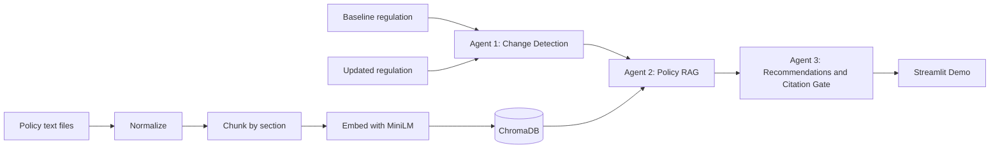
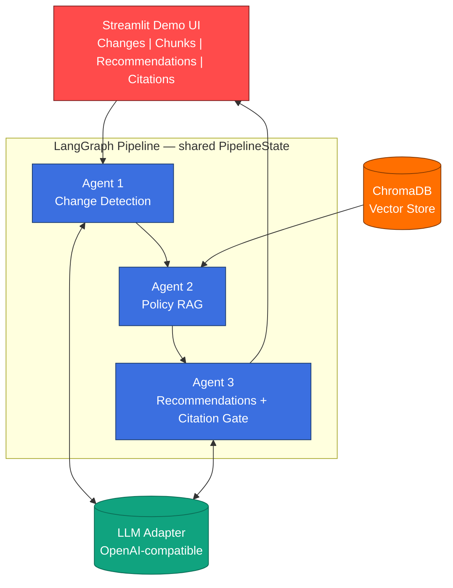

<div align="center">

# RegComply

**Multi-agent AI system for automated regulatory compliance document analysis**

*Detect regulatory changes, retrieve affected policies, draft citation-grounded update recommendations*

[](https://www.python.org/)
[](https://github.com/langchain-ai/langgraph)
[](https://www.llamaindex.ai/)
[](https://www.trychroma.com/)
[](https://streamlit.io/)
[](https://www.docker.com/)
[]()

</div>

<br>

> **Status: Academic research prototype.** Outputs are drafts for human review only and are **not legal advice**. This project is under active development as a continuing project at the State University of New York at Binghamton (through December 2026).

---

## Table of Contents

- [What is RegComply?](#what-is-regcomply)
- [The Problem](#the-problem)
- [How It Works](#how-it-works)
- [Architecture](#architecture)
- [Tech Stack](#tech-stack)
- [Project Structure](#project-structure)
- [Getting Started](#getting-started)
- [Running with Docker](#running-with-docker)
- [Usage](#usage)
- [Configuration](#configuration)
- [Evaluation](#evaluation)
- [Current Results](#current-results)
- [Roadmap](#roadmap)
- [Limitations](#limitations)
- [Changelog](#changelog)
- [References](#references)

---

## What is RegComply?

**RegComply** automates the workflow that compliance teams at financial institutions perform manually today:

1. Read a newly issued regulation (SEC, FINRA, etc.)
2. Identify every substantive change versus the prior version
3. Cross-reference those changes against internal policy documents
4. Draft specific, evidence-backed policy update recommendations

RegComply wires **three specialized AI agents** into a [LangGraph](https://github.com/langchain-ai/langgraph) pipeline, backed by local embeddings and retrieval-augmented generation (RAG), to do this end-to-end, with a working Streamlit demo.

---

## The Problem

<table>
<tr>
<td width="50%">

### Today (Manual)
- Weeks of analyst time per regulatory amendment
- $300K+/year in staff time industry-wide
- Error-prone, easy to miss a required update
- Missed updates risk fines, reputational damage, and officer liability

</td>
<td width="50%">

### With RegComply
- Automated change detection via LLM
- Semantic retrieval of affected policy clauses
- Citation-verified recommendation drafts
- Results in minutes via a web dashboard

</td>
</tr>
</table>

---

## How It Works



| Stage | Agent | Responsibility |
|---|---|---|
| 1 | **Change Detection** | Compares baseline vs. updated regulation text via LLM; extracts structured `change_items` (section, type, impact, excerpts) |
| 2 | **Policy RAG** | Embeds each detected change as a query and retrieves the most relevant internal policy chunks from ChromaDB |
| 3 | **Recommendations** | Drafts grounded policy update recommendations, then programmatically verifies that every quoted policy excerpt actually exists in its cited source chunk |

Every stage timing is recorded and every LLM parsing failure is logged rather than silently swallowed.

---

## Architecture



**Key design choices:**
- **Local embeddings** (`sentence-transformers/all-MiniLM-L6-v2`) — sensitive policy text never leaves your machine during retrieval.
- **Provider-agnostic LLM adapter** — targets any OpenAI-compatible endpoint (currently configured for NVIDIA NIM-hosted models).
- **Citation verification gate** — a concrete, programmatic anti-hallucination check, not just a prompt instruction.
- **Idempotent indexing** — rebuilding the policy index replaces the collection instead of duplicating chunks.
- **Schema-validated agent output** — every LLM response is validated against a Pydantic schema before use; malformed items are dropped and logged individually instead of silently discarding the whole response.
- **Fair retrieval across changes** — policy chunks are selected round-robin across all detected regulatory changes, so one change with strong matches cannot crowd out evidence for the others within the fixed retrieval budget.

---

## Tech Stack

| Layer | Technology |
|---|---|
| Language | Python 3.11+ |
| Agent orchestration | [LangGraph](https://github.com/langchain-ai/langgraph) |
| Retrieval / RAG | [LlamaIndex](https://www.llamaindex.ai/) |
| Vector store | [ChromaDB](https://www.trychroma.com/) |
| Embeddings | `sentence-transformers/all-MiniLM-L6-v2` (local, no API call) |
| LLM interface | OpenAI-compatible client (`openai` SDK) — targets NVIDIA NIM |
| Validation | [Pydantic](https://docs.pydantic.dev/) — schema validation for all LLM-generated structured output |
| UI | [Streamlit](https://streamlit.io/) |
| Config | `python-dotenv` |
| Containerization | [Docker](https://www.docker.com/) + Docker Compose |
| Lint | [ruff](https://docs.astral.sh/ruff/) |

---

## Project Structure

```
Termination_Project/
├── apps/
│   └── streamlit_app.py          # Web demo entry point
├── scripts/
│   └── build_index.py            # Offline policy index builder (CLI)
├── src/regcomply/
│   ├── ingest/normalize.py       # Text normalization
│   ├── chunking/split.py         # Paragraph-boundary chunker
│   ├── index/build.py            # ChromaDB + LlamaIndex index builder
│   ├── llm.py                    # OpenAI-compatible LLM adapter
│   ├── schemas.py                # Pydantic schemas for validating LLM output
│   ├── agents/
│   │   ├── change_detection.py   # Agent 1
│   │   ├── policy_rag.py         # Agent 2 (fair round-robin retrieval)
│   │   └── recommendations.py    # Agent 3 + citation gate
│   ├── graph/
│   │   ├── state.py              # Shared PipelineState
│   │   └── build.py              # LangGraph wiring + timing instrumentation
│   └── eval/
│       ├── gold.py               # Gold-set loader
│       ├── metrics.py            # recall@k, citation accuracy
│       └── run.py                # Evaluation harness runner
├── data/
│   ├── raw/
│   │   ├── regulations/           # Baseline / updated regulation pairs
│   │   └── policies/              # Internal policy corpus (synthetic)
│   └── eval/
│       └── gold_set.json         # Evaluation gold-set (document-level labels)
├── report/
│   └── progress_report.md        # Full project progress report
├── Dockerfile                     # Container image definition
├── docker-compose.yml             # One-command local orchestration
├── docker-entrypoint.sh           # Auto-builds index on first container run
├── CHANGELOG.md                   # Log of notable changes
└── pyproject.toml
```

---

## Getting Started

### Prerequisites
- Python **3.11+**
- An OpenAI-compatible LLM endpoint and API key (e.g. [NVIDIA NIM](https://build.nvidia.com/), OpenAI, or a self-hosted compatible server)

### 1. Clone and set up a virtual environment

```bash
git clone https://github.com/p-bidkar/Regulatory_Compliance_Analysis.git
cd Regulatory_Compliance_Analysis

python3 -m venv .venv
source .venv/bin/activate      # Windows: .venv\Scripts\activate
```

### 2. Install dependencies

```bash
pip install -e ".[dev]"
```

### 3. Configure environment variables

Copy the example file and fill in your credentials:

```bash
cp .env.example .env
```

```env
OPENAI_API_KEY=your_api_key_here
OPENAI_BASE_URL=https://your-openai-compatible-endpoint
OPENAI_MODEL=meta/llama-3.1-8b-instruct
```

If `OPENAI_MODEL` is left unset, it defaults to `meta/llama-3.1-8b-instruct`.

### 4. Build the policy index

```bash
python scripts/build_index.py
```

This normalizes, chunks, and embeds all documents in `data/raw/policies/` into a local ChromaDB store (`chroma_db/`). Safe to re-run — it replaces the collection rather than duplicating entries.

### 5. Launch the demo

```bash
streamlit run apps/streamlit_app.py
```

Open the printed local URL (typically `http://localhost:8501`) in your browser.

---

## Running with Docker

If you have Docker and Docker Compose installed, this is the fastest path to a working instance — no manual virtual environment or index build required.

### Prerequisites
- Docker + Docker Compose
- Several GB of free disk space (Python ML dependencies are large)
- A `.env` file with your LLM credentials (see [Configuration](#configuration))

### Run it

```bash
cp .env.example .env   # fill in your credentials first
docker compose up --build
```

Open `http://localhost:8501`.

On first start, the container automatically builds the policy index if none exists yet — no separate step needed. The index and the downloaded embedding model are persisted in named Docker volumes, so subsequent restarts are fast.

### Other useful commands

```bash
# Rebuild the policy index manually inside the container
docker compose run --rm regcomply python scripts/build_index.py

# Run the evaluation harness inside the container
docker compose run --rm regcomply python -m regcomply.eval

# Stop containers (keeps the persisted index)
docker compose down

# Stop and also wipe the persisted index + model cache
docker compose down -v
```

> Your `.env` file is never baked into the image — it's excluded via `.dockerignore` and loaded at container runtime instead.

---

## Usage

1. Select a **baseline** and **updated** regulation file from the sidebar.
2. Click **Run analysis**.
3. Explore the four result tabs:

| Tab | Contents |
|---|---|
| Changes detected | Every substantive change with section, type, and impact level |
| Policy chunks retrieved | Ranked policy excerpts with similarity scores |
| Recommendations | Current vs. recommended policy language, priority, and rationale |
| Citations & raw output | Verified/unverified citation status, stage timings, and raw JSON |

---

## Configuration

| Variable | Description | Default |
|---|---|---|
| `OPENAI_API_KEY` | API key for your LLM provider | — |
| `OPENAI_BASE_URL` | Base URL for an OpenAI-compatible endpoint | provider default |
| `OPENAI_MODEL` | Model identifier | `meta/llama-3.1-8b-instruct` |

---

## Evaluation

A working evaluation harness computes retrieval and citation metrics against a gold set:

```bash
python -m regcomply.eval
```

For each labeled case in `data/eval/gold_set.json`, it runs the full pipeline and reports:

| Metric | What it measures |
|---|---|
| Recall (document-level) | Whether the correct internal policy documents were retrieved for each regulatory change |
| Citation accuracy | Fraction of generated recommendations whose quoted policy text was verified against its source chunk |
| Stage timings | Per-agent latency (change detection, policy RAG, recommendations) |

A single case failing (missing files, missing credentials, an LLM error) is reported individually and does not stop the rest of the evaluation run.

> The current gold set labels are at the **document level**, not chunk level — a practical starting point, not the full labeled evaluation corpus described in the [Roadmap](#roadmap). Chunk-level labeling requires manual domain review and remains tracked future work.

---

## Current Results

As of the last evaluation checkpoint, running the full pipeline against a SEC Rule 17a-4 amendment pair with four synthetic internal policies:

- **14** substantive changes detected across effective dates, storage, retention, cloud requirements, and audit trail obligations
- **6** unique, relevant policy chunks retrieved
- Structured recommendations generated with citation verification status
- End-to-end latency: **~20-90 seconds**, depending on model choice

These are demo-scale observations from a single run, not a substitute for the metrics computed by the [evaluation harness](#evaluation). See [Roadmap](#roadmap) below for remaining evaluation work.

---

## Roadmap

- [x] Evaluation harness skeleton — recall (document-level), citation accuracy, and per-stage latency, runnable via `python -m regcomply.eval`
- [x] Schema-validated agent output — malformed LLM responses are caught and logged instead of silently discarded
- [x] Fair retrieval across detected changes — round-robin allocation instead of a single global score cutoff
- [x] Containerized deployment via Docker + Docker Compose
- [ ] Chunk-level (not just document-level) gold labels for retrieval evaluation
- [ ] Expand corpus to 5-10 historical SEC/FINRA amendment pairs
- [ ] Hybrid retrieval (BM25 + dense) for acronym-heavy legal text
- [ ] Cross-encoder reranking
- [ ] Human-in-the-loop review flag for low-confidence outputs
- [ ] Failure mode taxonomy and system hardening
- [ ] Final technical report (target: December 2026)

See [`report/progress_report.md`](report/progress_report.md) for the full timeline.

---

## Limitations

- This is a **research prototype**, not a production compliance system.
- The regulation and policy corpus is **synthetic** and small-scale; it is not a substitute for real legal review.
- No automated test suite yet.
- The system produces **drafts for human review**; always verify citations and recommendations before updating any real policy.

---

## Changelog

Notable changes are tracked in [`CHANGELOG.md`](CHANGELOG.md).

---

## References

1. Lewis, P. et al. (2020). *Retrieval-Augmented Generation for Knowledge-Intensive NLP Tasks.* NeurIPS.
2. Chase, H. (2022). *LangChain: Building applications with LLMs through composability.* GitHub.
3. Hong, S. et al. (2023). *MetaGPT: Meta Programming for Multi-Agent Collaborative Framework.* arXiv.
4. Reimers, N. & Gurevych, I. (2019). *Sentence-BERT: Sentence Embeddings using Siamese BERT-Networks.* EMNLP.
5. Liu, J. (2022). *LlamaIndex: A data framework for LLM applications.* GitHub.
6. Grand View Research (2024). *RegTech Market Size, Share and Trends Analysis Report.*

---

<div align="center">

**Author:** Prasanna Vinayak Bidkar · State University of New York at Binghamton
**Advisor:** Professor Madden

</div>
